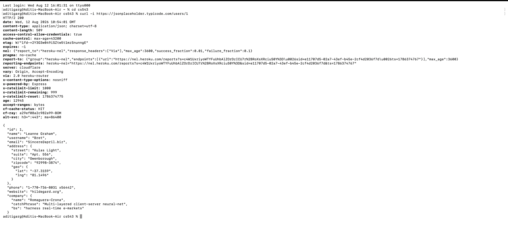
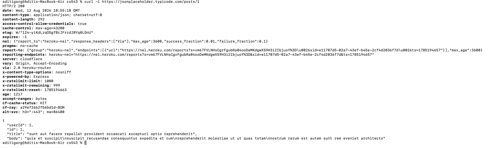
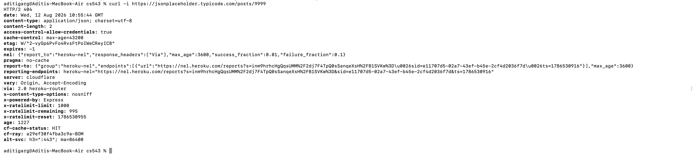
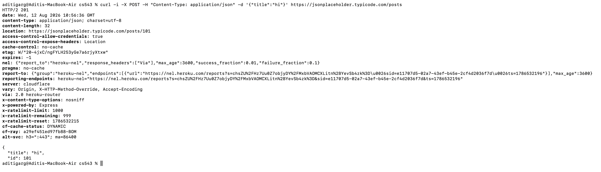
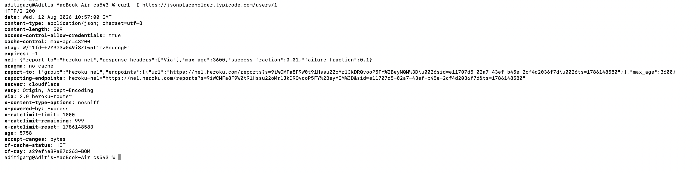

## Task 1: HTTP Log. Five Annotated Request and Response Pairs

**Objective:** Using `curl -i`, five requests were issued against a public, read only, unauthenticated JSON API. The full request and response were captured for each. One request was deliberately made against a resource that does not exist, in order to capture and document a `404` response. Each response is annotated with a one line note on the meaning of its status code and its `Content-Type` header.

**API used:** `https://jsonplaceholder.typicode.com`

---

### Request 1: GET an Existing Resource

**Command:**
```bash
curl -i https://jsonplaceholder.typicode.com/users/1
```

**Note:** Status `200 OK` indicates that the requested resource exists and is returned in the body below. The header `Content-Type: application/json` instructs the client to parse the body as JSON rather than HTML or plain text.



---

### Request 2: GET a Second Existing Resource

**Command:**
```bash
curl -i https://jsonplaceholder.typicode.com/posts/1
```

**Note:** Status `200 OK` is returned again, this time for a distinct resource type, confirming that the same status and content type contract holds consistently across every endpoint of the API.



---

### Request 3: GET a Non Existent Resource

**Command:**
```bash
curl -i https://jsonplaceholder.typicode.com/posts/9999
```

**Note:** Status `404 Not Found` indicates that the request was well formed and reached the server, but no resource exists at the requested identifier. The server still returns a properly formatted JSON body with the correct `Content-Type`, rather than an unstructured error page.



---

### Request 4: POST a New Resource

**Command:**
```bash
curl -i -X POST -H "Content-Type: application/json" \
-d '{"title":"hi"}' \
https://jsonplaceholder.typicode.com/posts
```

**Note:** Status `201 Created` indicates that a new resource was created from the submitted body. The accompanying `Location` header specifies the address at which the newly created resource now resides.



---

### Request 5: HEAD Request, Headers Only

**Command:**
```bash
curl -I https://jsonplaceholder.typicode.com/users/1
```

**Note:** Status `200 OK` is returned with the identical header set as Request 1, but no body follows. A `HEAD` request allows a client to confirm that a resource exists, and to inspect headers such as `Content Length`, without incurring the cost of downloading the body.



---
