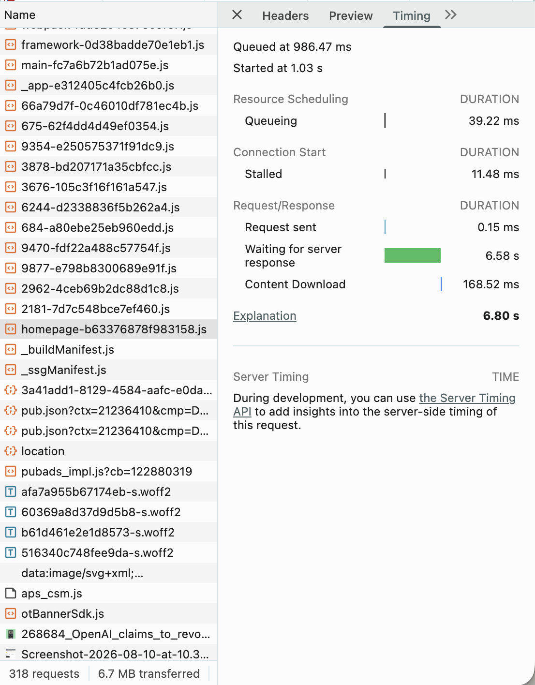
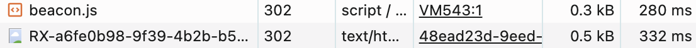

## Task 2: Network Analysis. Reading a Real Page Load

**Objective:** A real website was opened with the browser's DevTools Network panel visible. The Disable Cache option was enabled and the page was reloaded, so that every resource was fetched fresh instead of served from the local cache. The resulting waterfall of requests was then read and recorded: total request count, total page size, the single slowest resource, and any redirect or error responses present.

**Website analyzed:** `https://www.theverge.com`

**Reason for this choice:** A content heavy news homepage loads a wide mix of resource types at once, images, scripts, stylesheets, fonts, and third party requests, which produces a waterfall detailed enough to identify a clear slowest resource and to check meaningfully for redirects or errors, rather than a single flat page with only one or two requests.

---

### Step 1: Open DevTools and Disable Cache

The Network tab of DevTools was opened, and the Disable Cache checkbox near the top of the panel was ticked. The page was then reloaded with DevTools left open, and the load was allowed to finish completely before any reading was taken.

---

### Step 2: Record the Waterfall Summary

The bottom status bar of the Network panel reports the total request count, the total transferred size, and the load timing for the page. These figures were read directly from that bar once loading had finished.

| Metric | Value |
|---|---|
| Total requests | 318 |
| Total transferred (page size) | 6.7 MB |
| Total resource size (uncompressed) | 21.3 MB |
| Load time (Finish) | 8.5 min |

**Observation:** The request count and finish time were not stable across repeated captures of the same page (285 requests at 21.73 s, then 298 requests at 1.4 min, then 295 requests at 53.44 s, then 318 requests at 8.5 min across four successive captures). This is expected for an advertising and analytics heavy page such as this one: scripts continue to fire tracking and bidding requests in the background well after the visible content has finished rendering, so there is no single moment at which loading truly stops. The figures above are taken from the most recent, most complete capture.

---

### Step 3: Identify the Slowest Single Resource

The request list was scanned for the longest bar in the waterfall column, and that row was selected to open its Timing breakdown.

**Slowest resource.** `homepage-b63376878f983158.js`
**Resource type.** Script
**Total time.** 6.80 s
**Likely reason.** Almost the entire duration, 6.58 s of the 6.80 s total, was spent in the "Waiting for server response" phase, commonly called Time to First Byte (TTFB). This means the browser sent the request almost instantly and the file itself downloaded quickly (168.52 ms), but the server took an unusually long time to begin sending a response. This points to a slow server side process generating this bundle, rather than a large file size or a slow network connection.

*Timing breakdown, confirmed from the selected resource's Timing tab:*

| Phase | Duration |
|---|---|
| Queueing | 39.22 ms |
| Stalled | 11.48 ms |
| Request Sent | 0.15 ms |
| Waiting for Server Response (TTFB) | 6.58 s |
| Content Download | 168.52 ms |
| **Total** | **6.80 s** |

---

### Step 4: Check for Redirect or Error Responses

The request list was sorted by the Status column to look for any response in the 3xx or 4xx range.

| Status | Request | Likely reason |
|---|---|---|
| 302 | `beacon.js` (initiator: `VM543:1`) | A redirect issued by a script generated at runtime, commonly used by analytics or bot detection scripts that resolve their actual endpoint dynamically rather than being hardcoded. |
| 302 | `RX-a6fe0b98-9f39-4b2b-b5...` (initiator: `48ead23d-9eed-...`) | A temporary redirect issued by an advertising exchange as part of a bid or identity syncing handshake between two ad platforms, rather than a redirect belonging to the article content itself. |

No `4xx` client error responses (such as `404`) were found in the captured request list. The many `204 No Content` responses visible throughout the list are not errors: `204` is the standard, intentional response for analytics and tracking pixels that acknowledge receipt of data without returning a body.

---
